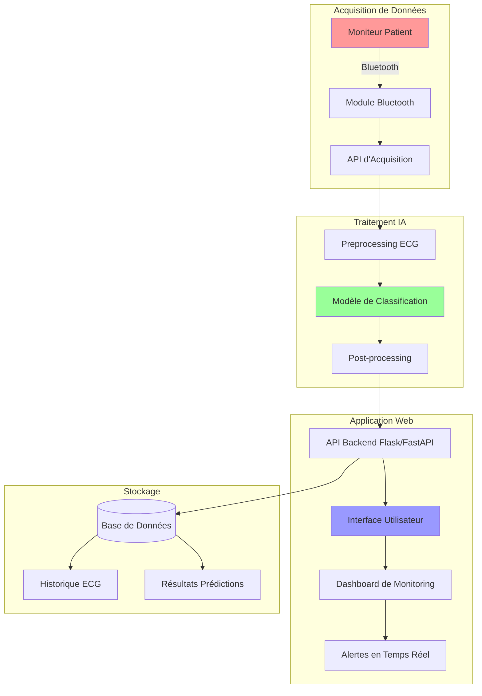
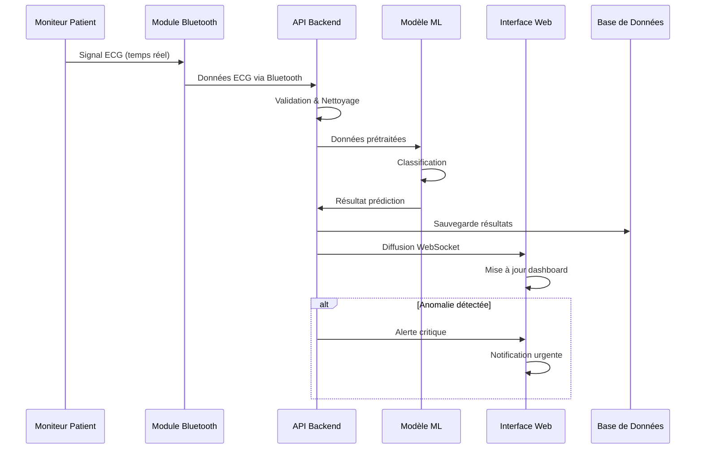
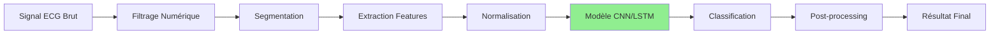
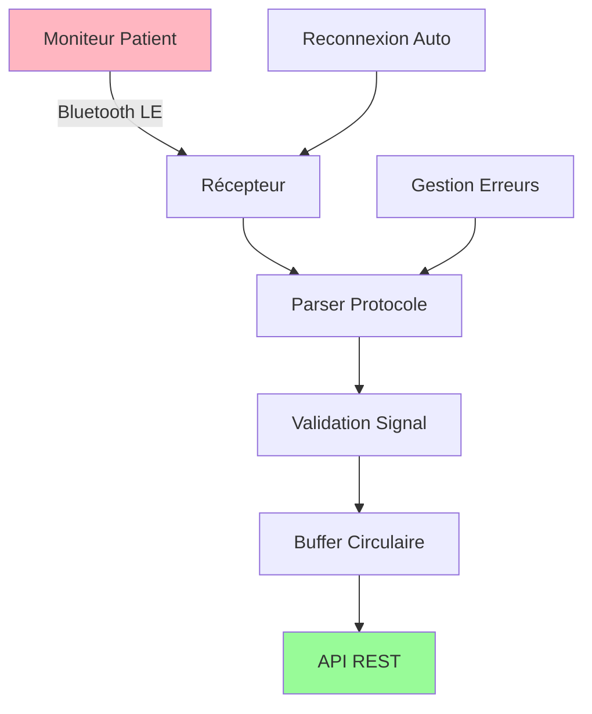
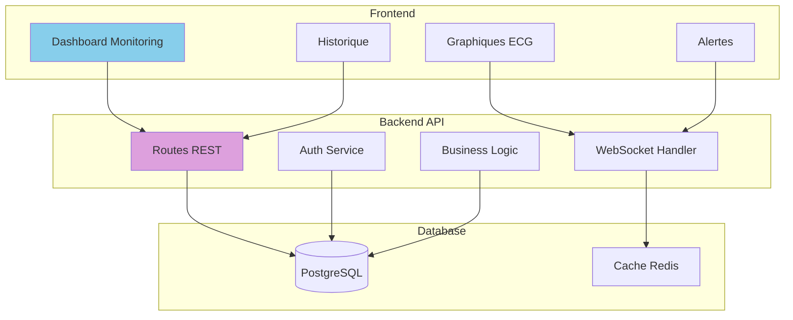
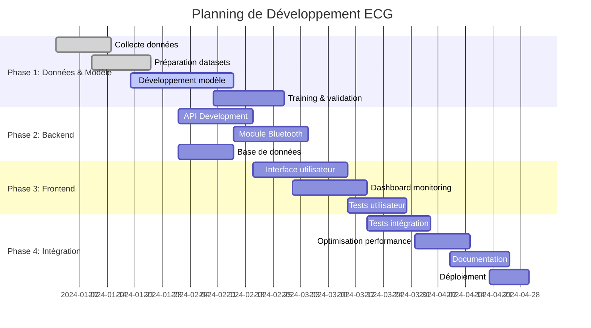
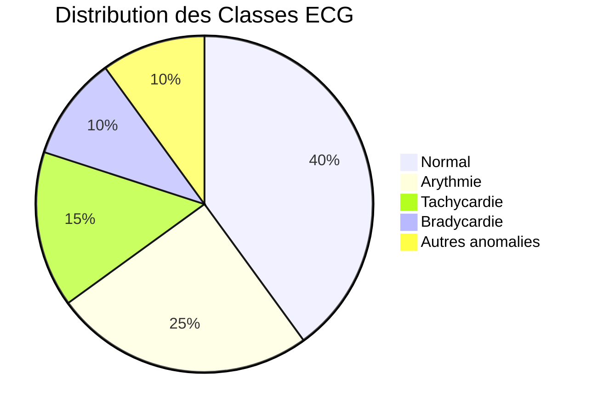
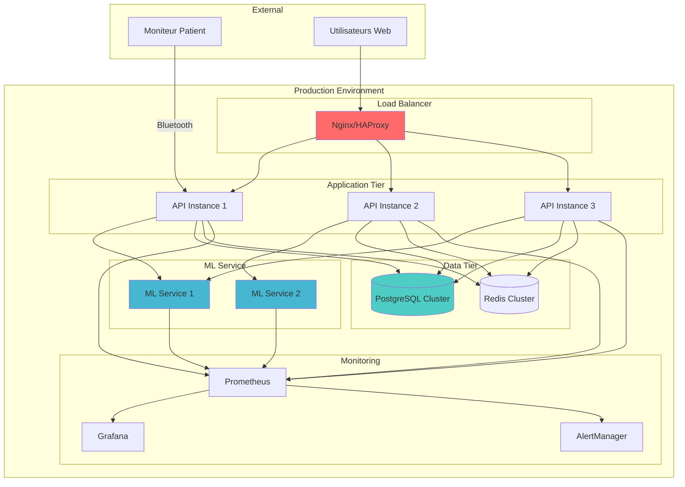
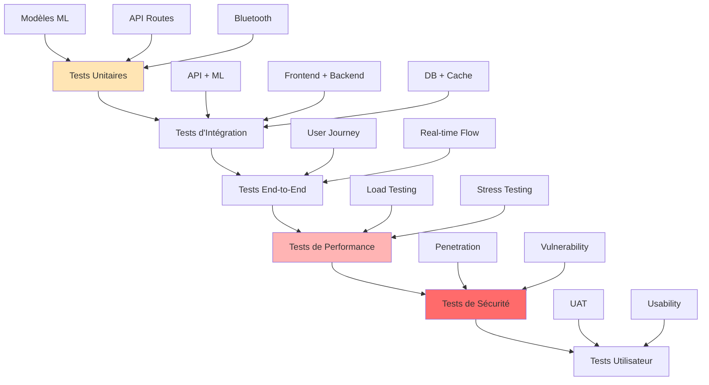

# 🫀 Système de Classification d'ECG en Temps Réel

## 📋 Table des Matières
- [1. Présentation du Projet](#1-présentation-du-projet)
- [2. Architecture Générale](#2-architecture-générale)
- [3. Structure du Projet](#3-structure-du-projet)
- [4. Flux de Données](#4-flux-de-données)
- [5. Modules Techniques](#5-modules-techniques)
- [6. Technologies et Outils](#6-technologies-et-outils)
- [7. Phases de Développement](#7-phases-de-développement)
- [8. Métriques et Validation](#8-métriques-et-validation)

---

## 1. Présentation du Projet

### 🎯 Titre
**Conception d'un système intelligent de classification de signaux ECG en temps réel, intégré à une application Web interconnecté à un moniteur patient.**

### 📊 Justification
Les maladies cardiovasculaires sont l'une des premières causes de décès dans le monde. Le diagnostic précoce, notamment à travers l'analyse d'ECG est crucial. Toutefois l'analyse manuelle est :
- ⏱️ **Lente** 
- ❌ **Sujette aux erreurs**
- 👨‍⚕️ **Dépendante de la disponibilité des spécialistes**

### 🎯 Objectifs

#### Objectif Général
Développer un système intelligent de classification d'ECG intégré à une plateforme Web, avec capacité de prédiction à partir de données captées en temps réel via le moniteur patient.

#### Objectifs Spécifiques
1. 🤖 Développer un modèle de classification d'ECG avec une précision > 85%
2. 🌐 Développer une application Web de visualisation et de prédiction 
3. 📡 Intégrer un module de récupération de données en réel depuis le moniteur 
4. 🔮 Appliquer une prédiction sur les signaux captés

---

## 2. Architecture Générale



---

## 3. Structure du Projet

```
ecg-classification/
├── 📁 data/
│   ├── raw/                    # Données ECG brutes
│   ├── processed/              # Données prétraitées
│   ├── external/               # Datasets externes
│   └── real_time/              # Buffer données temps réel
│
├── 📁 models/
│   ├── trained/                # Modèles entraînés (.h5, .pkl)
│   ├── architectures/          # Définitions des modèles
│   ├── preprocessing/          # Modules de prétraitement
│   └── evaluation/             # Scripts d'évaluation
│
├── 📁 notebooks/
│   ├── 01_data_exploration.ipynb
│   ├── 02_model_training.ipynb
│   ├── 03_model_evaluation.ipynb
│   └── 04_real_time_testing.ipynb
│
├── 📁 src/
│   ├── 📁 data/
│   │   ├── acquisition.py      # Module Bluetooth
│   │   ├── preprocessing.py    # Nettoyage données
│   │   └── validation.py       # Validation données
│   │
│   ├── 📁 models/
│   │   ├── cnn_model.py        # Architecture CNN
│   │   ├── lstm_model.py       # Architecture LSTM
│   │   ├── ensemble.py         # Modèles ensemble
│   │   └── predictor.py        # Prédictions temps réel
│   │
│   ├── 📁 api/
│   │   ├── app.py              # Application Flask/FastAPI
│   │   ├── routes.py           # Routes API
│   │   ├── websocket.py        # WebSocket temps réel
│   │   └── auth.py             # Authentification
│   │
│   └── 📁 frontend/
│       ├── static/             # CSS, JS, images
│       ├── templates/          # Templates HTML
│       └── components/         # Composants UI
│
├── 📁 tests/
│   ├── test_models.py
│   ├── test_api.py
│   └── test_bluetooth.py
│
├── 📁 docs/
│   ├── api_documentation.md
│   ├── user_manual.md
│   └── deployment_guide.md
│
├── 📁 configs/
│   ├── model_config.yaml
│   ├── api_config.yaml
│   └── bluetooth_config.yaml
│
├── requirements.txt
├── Dockerfile
├── docker-compose.yml
└── README.md
```

---

## 4. Flux de Données



---

## 5. Modules Techniques

### 🤖 Module de Classification ML



**Caractéristiques :**
- 🏗️ **Architecture :** CNN + LSTM hybride
- 📊 **Classes :** Normal, Arythmie, Tachycardie, Bradycardie, etc.
- 🎯 **Performance cible :** > 85% accuracy
- ⚡ **Latence :** < 100ms

### 📡 Module Acquisition Bluetooth



### 🌐 Module Application Web



---

## 6. Technologies et Outils

### 🔧 Stack Technique

| Composant | Technologies | Justification |
|-----------|-------------|---------------|
| **ML/IA** | Python, TensorFlow/Keras, Scikit-learn | Écosystème mature pour deep learning |
| **Backend** | Flask/FastAPI, SQLAlchemy, Redis | Performance et scalabilité |
| **Frontend** | React/Vue.js, Chart.js, WebSockets | Interface réactive temps réel |
| **Communication** | Bluetooth LE, WebSocket, REST API | Communication temps réel fiable |
| **Database** | PostgreSQL, Redis | Stockage robuste + cache |
| **Deployment** | Docker, Kubernetes, CI/CD | Déploiement et maintenance |

### 📊 Librairies Spécialisées

```python
# Deep Learning
tensorflow>=2.12.0
keras>=2.12.0
scikit-learn>=1.3.0

# Signal Processing
scipy>=1.10.0
numpy>=1.24.0
pandas>=2.0.0

# Visualization
matplotlib>=3.7.0
plotly>=5.14.0
seaborn>=0.12.0

# Web Framework
fastapi>=0.95.0
uvicorn>=0.21.0
websockets>=11.0

# Bluetooth Communication
pybluez>=0.23
bleak>=0.20.0

# Database
sqlalchemy>=2.0.0
psycopg2>=2.9.0
redis>=4.5.0
```

---

## 7. Phases de Développement



### 🎯 Livrables par Phase

#### Phase 1 : Modèle IA (4 semaines)
- ✅ Dataset ECG nettoyé et segmenté
- ✅ Modèle CNN/LSTM entraîné
- ✅ Validation croisée > 85% accuracy
- ✅ Export modèle optimisé

#### Phase 2 : Backend (4 semaines)
- ✅ API REST fonctionnelle
- ✅ Module Bluetooth opérationnel
- ✅ Base de données configurée
- ✅ WebSocket temps réel

#### Phase 3 : Frontend (3 semaines)
- ✅ Interface web responsive
- ✅ Dashboard monitoring en temps réel
- ✅ Système d'alertes
- ✅ Tests utilisateur validés

#### Phase 4 : Intégration (3 semaines)
- ✅ Tests end-to-end
- ✅ Optimisations performance
- ✅ Documentation complète
- ✅ Déploiement production

---

## 8. Métriques et Validation

### 📊 Métriques du Modèle



### 🎯 KPIs de Performance

| Métrique | Cible | Critique |
|----------|-------|----------|
| **Accuracy** | > 85% | > 90% |
| **Precision** | > 80% | > 85% |
| **Recall** | > 80% | > 85% |
| **F1-Score** | > 80% | > 85% |
| **Latence Prédiction** | < 100ms | < 50ms |
| **Disponibilité** | > 99% | > 99.9% |

### 🔍 Matrice de Confusion Cible

```
               Prédictions
Réalité    Normal  Arythmie  Tachy  Brady
Normal       95%      2%      2%     1%
Arythmie      3%     92%      3%     2%
Tachy         2%      3%     90%     5%
Brady         1%      4%      5%    90%
```

---

## 9. Architecture de Déploiement



---

## 10. Sécurité et Conformité

### 🔒 Mesures de Sécurité

- 🔐 **Chiffrement** : TLS 1.3 pour toutes communications
- 👤 **Authentification** : OAuth 2.0 + JWT
- 🛡️ **Autorisation** : RBAC (Role-Based Access Control)
- 🔍 **Audit** : Logs complets des accès et actions
- 💾 **Données** : Chiffrement AES-256 at rest
- 🌐 **API** : Rate limiting et validation stricte

### 📋 Conformité Médicale

- ✅ **RGPD** : Protection données personnelles
- ✅ **ISO 27001** : Sécurité information
- ✅ **IEC 62304** : Logiciels dispositifs médicaux
- ✅ **FDA Guidelines** : Validation algorithmes ML médicaux

---

## 11. Plan de Tests

### 🧪 Stratégie de Test



---

## 🚀 Conclusion

Ce projet représente une solution complète de télémédecine pour le monitoring cardiaque, combinant :

- 🤖 **Intelligence Artificielle** avancée pour la classification ECG
- 🌐 **Technologies Web** modernes pour l'interface utilisateur
- 📡 **Communication IoT** pour l'acquisition temps réel
- 🏥 **Standards médicaux** pour la sécurité et conformité

L'architecture modulaire permet une évolutivité et une maintenance optimales, while garantissant les performances critiques nécessaires en contexte médical.

---

*Document créé le : 2024*  
*Version : 1.0*  
*Auteur : Équipe de Développement ECG*