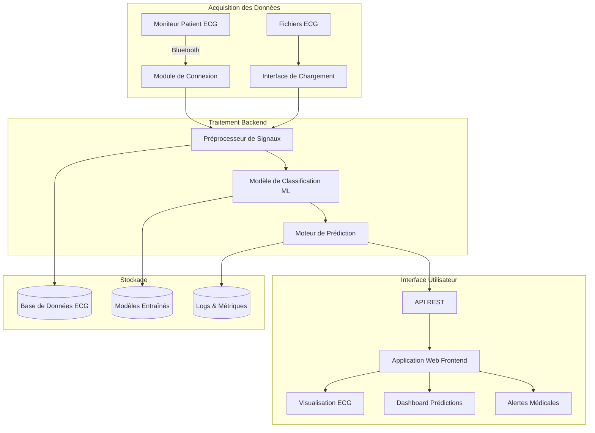
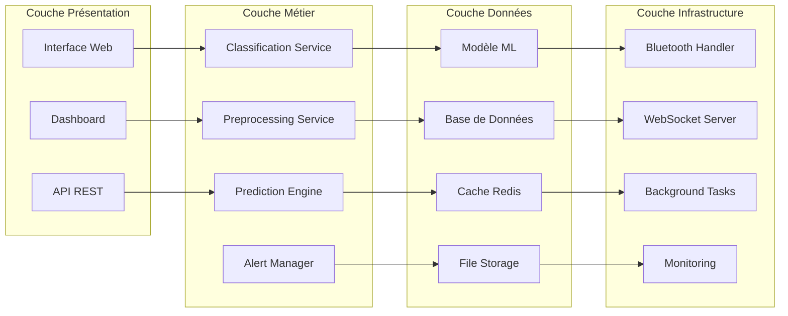
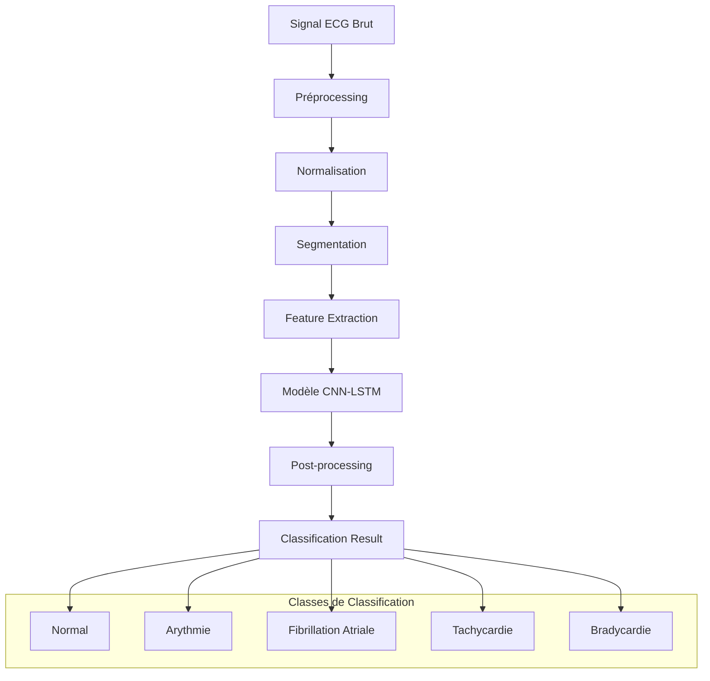
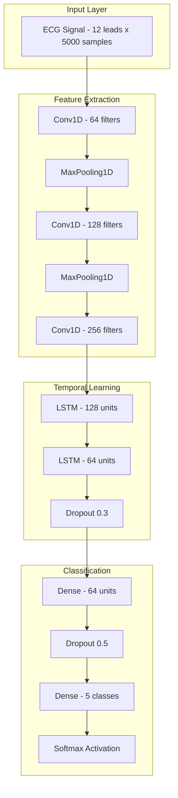
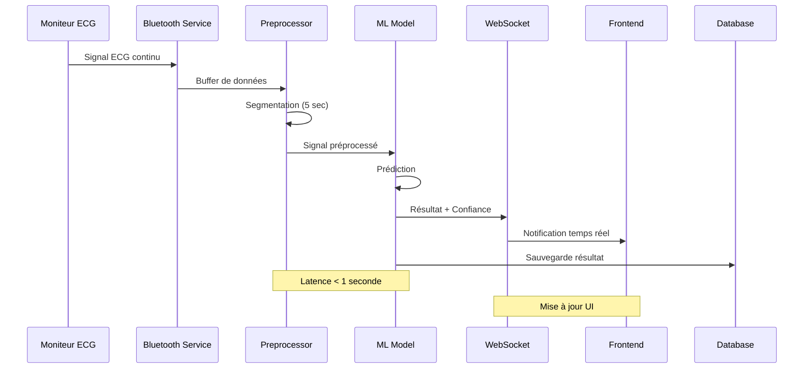
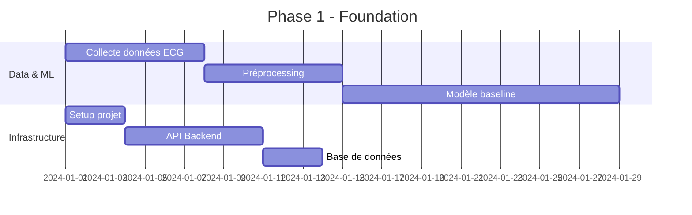
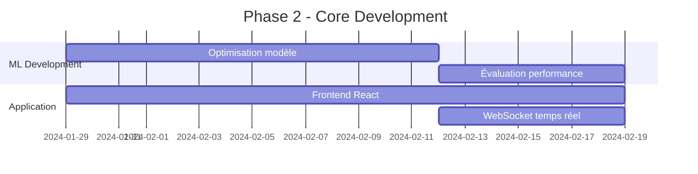
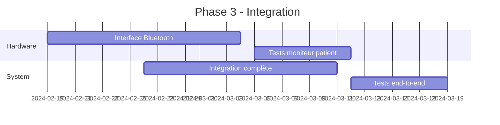
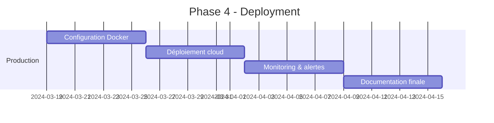
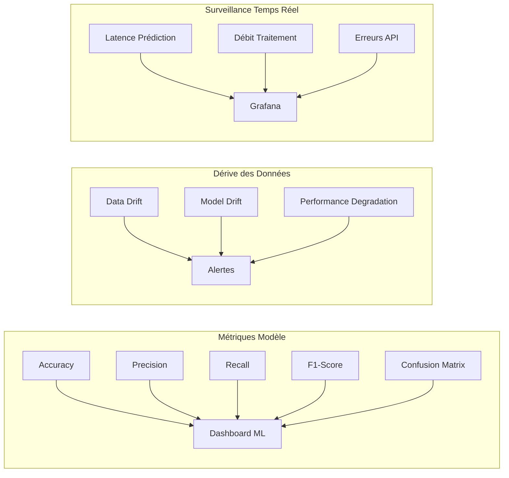

# Système de Classification d'ECG en Temps Réel
## Architecture et Documentation Technique

---

## 📋 Table des Matières

1. [Vue d'ensemble du Projet](#vue-densemble-du-projet)
2. [Architecture Système](#architecture-système)
3. [Structure du Projet](#structure-du-projet)
4. [Composants Techniques](#composants-techniques)
5. [Flux de Données](#flux-de-données)
6. [Diagrammes d'Architecture](#diagrammes-darchitecture)
7. [Technologies et Outils](#technologies-et-outils)
8. [Objectifs et Métriques](#objectifs-et-métriques)
9. [Plan de Développement](#plan-de-développement)

---

## 🎯 Vue d'ensemble du Projet

### Titre
**Conception d'un système intelligent de classification de signaux ECG en temps réel, intégré à une application Web interconnectée à un moniteur patient.**

### Justification
Les maladies cardiovasculaires représentent la première cause de décès dans le monde. Le diagnostic précoce via l'analyse d'ECG est crucial, mais l'analyse manuelle présente des limitations :
- ⏱️ Lenteur du processus
- ❌ Risque d'erreurs humaines
- 👨‍⚕️ Dépendance à la disponibilité des spécialistes

### Solution Proposée
Développement d'un système automatisé basé sur le **Deep Learning** pour :
- 🤖 Classification automatique des signaux ECG
- ⚡ Traitement en temps réel
- 🌐 Interface web intuitive
- 📡 Connexion directe aux moniteurs patients
- 🏥 Support de la télémédecine

---

## 🏗️ Architecture Système

### Architecture Globale



### Architecture en Couches



---

## 📁 Structure du Projet

```
ecg_classification_system/
├── 📂 data/
│   ├── 📂 raw/                    # Données ECG brutes
│   ├── 📂 processed/              # Données prétraitées
│   ├── 📂 external/               # Datasets externes
│   └── 📂 interim/                # Données intermédiaires
│
├── 📂 models/
│   ├── 📂 trained/                # Modèles entraînés (.h5, .pkl)
│   ├── 📂 checkpoints/            # Checkpoints d'entraînement
│   └── 📂 experiments/            # Expérimentations ML
│
├── 📂 src/
│   ├── 📂 data/
│   │   ├── preprocessing.py       # Prétraitement des signaux ECG
│   │   ├── data_loader.py         # Chargement des données
│   │   └── augmentation.py        # Augmentation de données
│   │
│   ├── 📂 models/
│   │   ├── cnn_model.py           # Modèle CNN pour ECG
│   │   ├── lstm_model.py          # Modèle LSTM
│   │   ├── ensemble.py            # Modèles d'ensemble
│   │   └── base_model.py          # Classe de base
│   │
│   ├── 📂 training/
│   │   ├── train.py               # Script d'entraînement
│   │   ├── evaluate.py            # Évaluation des modèles
│   │   └── hyperparameter_tuning.py
│   │
│   ├── 📂 inference/
│   │   ├── predictor.py           # Moteur de prédiction
│   │   ├── real_time_processor.py # Traitement temps réel
│   │   └── batch_processor.py     # Traitement par lot
│   │
│   └── 📂 utils/
│       ├── signal_utils.py        # Utilitaires signaux
│       ├── metrics.py             # Métriques d'évaluation
│       └── visualization.py       # Visualisation
│
├── 📂 backend/
│   ├── 📂 api/
│   │   ├── routes/
│   │   │   ├── ecg_routes.py      # Routes ECG
│   │   │   ├── prediction_routes.py
│   │   │   └── monitoring_routes.py
│   │   ├── middleware/             # Middleware API
│   │   └── schemas/                # Schémas de validation
│   │
│   ├── 📂 services/
│   │   ├── ecg_service.py         # Service ECG
│   │   ├── prediction_service.py  # Service prédiction
│   │   ├── bluetooth_service.py   # Service Bluetooth
│   │   └── websocket_service.py   # Service WebSocket
│   │
│   ├── 📂 database/
│   │   ├── models.py              # Modèles de données
│   │   ├── database.py            # Configuration DB
│   │   └── migrations/            # Migrations DB
│   │
│   └── main.py                    # Point d'entrée API
│
├── 📂 frontend/
│   ├── 📂 src/
│   │   ├── 📂 components/
│   │   │   ├── ECGChart.js        # Composant graphique ECG
│   │   │   ├── Dashboard.js       # Dashboard principal
│   │   │   ├── PredictionPanel.js # Panneau prédictions
│   │   │   └── AlertSystem.js     # Système d'alertes
│   │   │
│   │   ├── 📂 services/
│   │   │   ├── api.js             # Client API
│   │   │   ├── websocket.js       # Client WebSocket
│   │   │   └── bluetooth.js       # Interface Bluetooth
│   │   │
│   │   ├── 📂 pages/
│   │   │   ├── Dashboard.js       # Page tableau de bord
│   │   │   ├── RealTime.js        # Page temps réel
│   │   │   └── History.js         # Page historique
│   │   │
│   │   └── App.js                 # Composant principal
│   │
│   ├── package.json
│   └── public/
│
├── 📂 hardware/
│   ├── bluetooth_interface.py     # Interface Bluetooth
│   ├── device_manager.py          # Gestionnaire périphériques
│   └── protocols/                 # Protocoles communication
│
├── 📂 notebooks/
│   ├── 01_data_exploration.ipynb  # Exploration des données
│   ├── 02_model_development.ipynb # Développement modèle
│   ├── 03_evaluation.ipynb        # Évaluation
│   └── 04_visualization.ipynb     # Visualisation
│
├── 📂 tests/
│   ├── test_models.py             # Tests modèles
│   ├── test_api.py                # Tests API
│   ├── test_services.py           # Tests services
│   └── test_integration.py        # Tests d'intégration
│
├── 📂 deployment/
│   ├── Dockerfile                 # Container Docker
│   ├── docker-compose.yml         # Orchestration
│   ├── kubernetes/                # Manifests K8s
│   └── scripts/                   # Scripts déploiement
│
├── 📂 docs/
│   ├── api_documentation.md       # Documentation API
│   ├── user_guide.md             # Guide utilisateur
│   └── technical_specs.md        # Spécifications techniques
│
├── requirements.txt               # Dépendances Python
├── package.json                   # Dépendances Node.js
├── README.md                      # Documentation principale
└── .env.example                   # Variables d'environnement
```

---

## 🔧 Composants Techniques

### 1. Module de Classification ML



### 2. Architecture du Modèle Deep Learning



### 3. Flux de Données Temps Réel



---

## 🛠️ Technologies et Outils

### Machine Learning & Data Science
| Composant | Technologie | Usage |
|-----------|-------------|-------|
| **Framework ML** | TensorFlow/Keras | Développement des modèles CNN-LSTM |
| **Traitement Signal** | SciPy, PyWavelets | Préprocessing des signaux ECG |
| **Analyse de Données** | Pandas, NumPy | Manipulation et analyse des données |
| **Visualisation** | Matplotlib, Plotly | Graphiques et visualisation ECG |
| **Métriques** | Scikit-learn | Évaluation des performances |

### Backend & API
| Composant | Technologie | Usage |
|-----------|-------------|-------|
| **Framework Web** | FastAPI | API REST haute performance |
| **Base de Données** | PostgreSQL | Stockage des données ECG |
| **Cache** | Redis | Cache des prédictions |
| **Message Queue** | Celery | Tâches asynchrones |
| **WebSocket** | WebSocket | Communication temps réel |

### Frontend
| Composant | Technologie | Usage |
|-----------|-------------|-------|
| **Framework** | React.js | Interface utilisateur |
| **Graphiques** | Chart.js, D3.js | Visualisation ECG interactive |
| **UI Components** | Material-UI | Composants interface |
| **État Global** | Redux | Gestion d'état |
| **WebSocket Client** | Socket.io | Communication temps réel |

### Communication & Hardware
| Composant | Technologie | Usage |
|-----------|-------------|-------|
| **Bluetooth** | PyBluez, Bleak | Communication moniteur patient |
| **Protocoles** | HL7 FHIR | Standards médicaux |
| **Sérialisation** | Protocol Buffers | Optimisation transfert données |

### DevOps & Déploiement
| Composant | Technologie | Usage |
|-----------|-------------|-------|
| **Containerisation** | Docker | Packaging application |
| **Orchestration** | Kubernetes | Déploiement scalable |
| **CI/CD** | GitHub Actions | Intégration continue |
| **Monitoring** | Prometheus, Grafana | Surveillance système |

---

## 📊 Objectifs et Métriques

### Objectif Général
Développer un système intelligent de classification d'ECG intégré à une plateforme Web, avec capacité de prédiction en temps réel.

### Objectifs Spécifiques

#### 1. Performance du Modèle ML
| Métrique | Objectif | Seuil Minimum |
|----------|----------|---------------|
| **Précision** | > 90% | 85% |
| **Rappel** | > 90% | 85% |
| **F1-Score** | > 90% | 85% |
| **Spécificité** | > 95% | 90% |

#### 2. Performance Système
| Métrique | Objectif | Seuil Maximum |
|----------|----------|---------------|
| **Latence Prédiction** | < 500ms | 1000ms |
| **Débit** | > 100 ECG/min | 50 ECG/min |
| **Disponibilité** | > 99.5% | 99% |
| **Temps de Réponse API** | < 200ms | 500ms |

#### 3. Qualité du Code
| Métrique | Objectif |
|----------|----------|
| **Couverture Tests** | > 90% |
| **Documentation** | 100% fonctions |
| **Standards Code** | PEP8, ESLint |

---

## 📈 Plan de Développement

### Phase 1: Foundation (Semaines 1-4)


### Phase 2: Core Development (Semaines 5-8)


### Phase 3: Integration (Semaines 9-12)


### Phase 4: Deployment (Semaines 13-16)


---

## 🔍 Métriques de Surveillance

### Surveillance ML


### Dashboard de Monitoring
- 📊 **Métriques de Performance ML** : Précision, rappel, F1-score en temps réel
- 🚨 **Alertes Système** : Latence élevée, erreurs, pannes
- 📈 **Analyse des Tendances** : Évolution des performances
- 🔍 **Traçabilité** : Logs détaillés des prédictions

---

## 🚀 Résultats Attendus

### Livrables Principaux

1. **🤖 Modèle de Classification ECG**
   - Performance > 85% sur toutes les métriques
   - Support de 5 classes principales d'arythmies
   - Temps d'inférence < 500ms

2. **🌐 Application Web Complète**
   - Interface intuitive pour visualisation ECG
   - Dashboard temps réel avec prédictions
   - Système d'alertes médicales automatisé
   - Historique des examens et tendances

3. **📡 Module de Connexion Temps Réel**
   - Interface Bluetooth stable avec moniteurs patients
   - Traitement streaming des signaux ECG
   - Prédictions automatiques et instantanées
   - Notifications push en cas d'anomalies

4. **📋 Documentation Technique**
   - Guide d'installation et déploiement
   - Documentation API complète
   - Manuel utilisateur médical
   - Protocoles de maintenance

### Impact Attendu
- 🏥 **Amélioration du diagnostic** : Réduction du temps de diagnostic de 70%
- 👨‍⚕️ **Support aux professionnels** : Assistance au diagnostic pour médecins non-cardiologues
- 🌍 **Télémédecine** : Monitoring à distance des patients
- 📊 **Traçabilité** : Historique complet des examens ECG

---

## 📞 Support et Maintenance

### Équipe Technique
- **Data Scientist** : Développement et optimisation des modèles ML
- **Backend Developer** : API et services backend
- **Frontend Developer** : Interface utilisateur et expérience
- **DevOps Engineer** : Déploiement et infrastructure
- **Medical Advisor** : Validation clinique et spécifications médicales

### Maintenance Continue
- 🔄 **Mise à jour des modèles** : Réentraînement périodique
- 🔒 **Sécurité** : Audits et mises à jour de sécurité
- 📊 **Monitoring** : Surveillance 24/7 des performances
- 🆘 **Support** : Assistance technique et formation utilisateurs

---

*Document généré pour le projet de Système de Classification d'ECG en Temps Réel*
*Version 1.0 - Architecture et Documentation Technique*